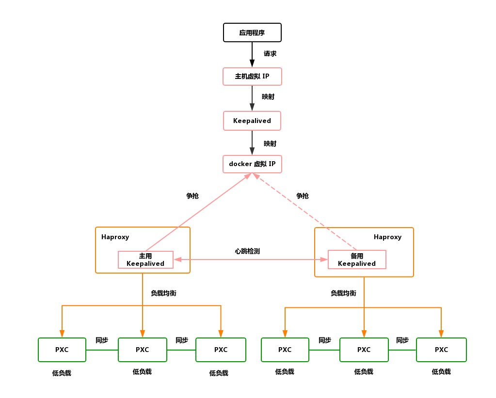

此操作只能在本地服务器使用，因为云服务器不支持虚拟 ip 技术。

## 架构图

<div align="center"></div>

## 如何使用

### 一、创建五节点的 pxc 集群

```c
$ mysql-pxc.sh
```

接收两个参数，第一个 MySQL 实例的起始端口号和数据库的密码

### 二、创建两个 Haproxy 节点

- 两个 haproxy 节点除了映射到主机的 ip、分配的 docker 网络的 ip、容器名字不一样以外，其他都一样。

```c
$ sh haproxy1.sh
$ sh haproxy2.sh
```

- 在之前的数据库中创建一个无密码的账户，用来做心跳检测

```c
$ docker exec -it pxc1 bash
$ mysql -uroot -proot -e "create user 'haproxy'@'%' IDENTIFIED BY '';"
```

- 访问 `ip:4001/dbs` 查看是否创建成功。


### 三、在 Haproxy 节点中和宿主机中安装 

>以下操作都要根据宿主机网卡的地址段来分配 ip,主要将 `192.168.88.150` 更改一下。只需改 `keepalived/host/keepalived.conf` 文件即可。

- 在宿主机中安装 Keepalived

为宿主机上定义的虚拟 IP 为 `192.168.88.150`

```c
$ sudo apt install keepalived -y
$ cp keepalived/host/keepalived.conf /etc/keepalived
$ service keepalived start
$ ping 192.168.88.150
```

- 在 Haproxy 节点中安装 Keepalived

首先复制配置文件到容器内

```c
$ docker exec -it haproxy1 bash -c "mkdir /etc/keepalived"
$ docker exec -it haproxy2 bash -c "mkdir /etc/keepalived"
$ docker cp $PWD/keepalived/h1/keepalived.conf haproxy1:/etc/keepalived
$ docker cp $PWD/keepalived/h2/keepalived.conf haproxy2:/etc/keepalived
```

然后先换阿里源，安装并启动 Keepalived

```c
$ docker exec -it haproxy1 bash
$ echo deb http://mirrors.aliyun.com/debian wheezy main contrib non-free \
    deb-src http://mirrors.aliyun.com/debian wheezy main contrib non-free \
    deb http://mirrors.aliyun.com/debian wheezy-updates main contrib non-free \
    deb-src http://mirrors.aliyun.com/debian wheezy-updates main contrib non-free \
    deb http://mirrors.aliyun.com/debian-security wheezy/updates main contrib non-free \
    deb-src http://mirrors.aliyun.com/debian-security wheezy/updates main contrib non-free \
    > /etc/apt/sources.list
$ apt-get update
$ apt install keepalived -y
$ service keepalived start
```

```c
$ docker exec -it haproxy2 bash
$ echo deb http://mirrors.aliyun.com/debian wheezy main contrib non-free \
    deb-src http://mirrors.aliyun.com/debian wheezy main contrib non-free \
    deb http://mirrors.aliyun.com/debian wheezy-updates main contrib non-free \
    deb-src http://mirrors.aliyun.com/debian wheezy-updates main contrib non-free \
    deb http://mirrors.aliyun.com/debian-security wheezy/updates main contrib non-free \
    deb-src http://mirrors.aliyun.com/debian-security wheezy/updates main contrib non-free \
    > /etc/apt/sources.list
$ apt-get update
$ apt install keepalived -y
$ service keepalived start
```

### 测试是否成功

- 访问 `192.168.88.150:8888/dbs` 看能否看到 haproxy 的监控页面

- 使用 `192.168.88.150:3306` 看能否登录数据库

- 停掉一个 haproxy 后看上面操作是否还能成功，若都没有问题，则代表搭建成功。