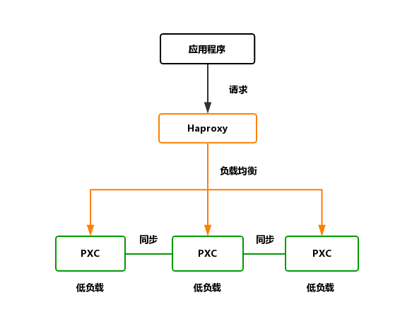

## 架构图

<div align="center"></div>

## 如何使用

### 一、创建五节点的 MySQL PXC 集群

```sh
$ mysql-pxc.sh
```

接收两个参数，第一个 MySQL 实例的起始端口号和数据库的密码

### 二、创建 Haproxy 负载均衡器

- 首先要在之前的数据库中创建一个无密码的账户，用来做心跳检测

```sh
$ docker exec -it pxc1 bash
$ mysql -uroot -ppassword -e "create user 'haproxy'@'%' IDENTIFIED BY '';"
```

- 然后运行 Haproxy 容器

```sh
$ sh haproxy.sh
```

- 访问 `ip:4001/dbs`,可看到监控页面，用户名和密码是 `root`，`ip:4002` 为数据库连接地址

## 其他

mysqlslap 并发测试命令：

```sh
mysqlslap -hlocalhost -uroot -proot -P3306 \
--concurrency=500 --iterations=1 --auto-generate-sql \
--auto-generate-sql-load-type=mixed \
--auto-generate-sql-add-autoincrement \
--engine=innodb \
--number-of-queries=500
```